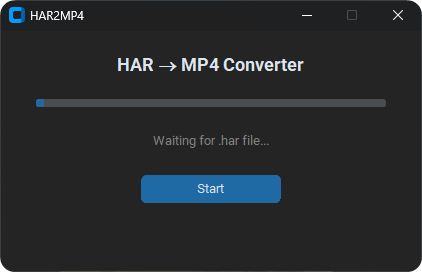

> [!NOTE]
> HAR2MP4 – утилита для автоматического извлечения видео из файлов `.har` и сборки их в полноценные `.mp4`. Скрипт анализирует HAR-файл, выбирает лучшие сегменты по качеству и размеру, скачивает их и объединяет в готовое видео с помощью FFmpeg.

## Требования для выполнения скрипта
- Windows 10/11.
- `.har` файл с сегментами видео.

## Запуск скрипта
- [Скачайте скрипт](https://github.com/RDF1337/har2mp4GUI/releases/download/v1.0.0/har2mp4GUI.rar).
- Поместите файл `name.har` в папку со скриптом.
- Запустите `har2mp4.exe` и нажмите Start.
- Дождитесь окончания работы скрипта. Готовый файл появится в папке `output`.

